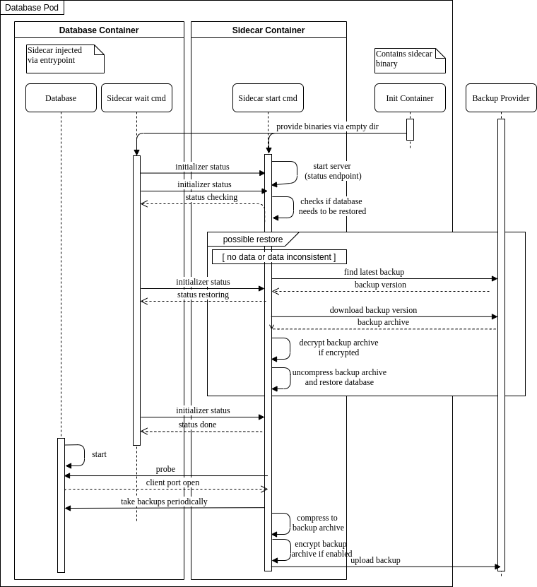

# K8s Backup Restore Sidecar for Databases

This project adds automatic backup and recovery to databases managed by K8s via sidecar.

The idea is taken from the [etcd-backup-restore](https://github.com/gardener/etcd-backup-restore) project.

Probably, it does not make sense to use this project with large databases. However, if it is certain that a database will never grow large, the auto-recovery mechanism can come in very handy.

## Supported Databases

| Database  | Image     | Status |
| --------- | --------- | ------ |
| postgres  | 12-alpine | alpha  |
| rethinkdb | 2.4.0     | alpha  |

## Supported Compression Methods

With `--compression-method` you can define how generated backups are compressed before stored at the storage provider. Available compression methods are:

| compression-method | suffix   | comments |
| ------------------ | -------- | -------- |
| tar                | .tar     | no compression, best suited for already compressed content |
| targz              | .tar.gz  | tar and gzip, most commonly used, best compression ratio, average performance |
| tarlz4             | .tar.lz4 | tar and lz4, very fast compression/decompression speed compared to gz, slightly bigger files |

## Supported Storage Providers

- GCS Buckets
- S3 Buckets (tested against Ceph RADOS gateway)
- Local

## Encryption

For all three storage providers are AES encryption is supported, can be enabled with `--encryption-key=<YOUR_KEY>`.
The key must be either 16 bytes (AES-128), 24 bytes (AES-192) or 32 bytes (AES-256) long.
The backups are stored at the storage provider with the `.aes` suffix. If the file does not have this suffix, decryption is skipped.

## How it works

## Limitations

- The database is deployed unclustered / standalone
- The database is deployed as a statefulset and the data is backed by a PVC
- No "Point in Time Recovery" (PITR)

## Try it out

Requires:

- [docker](https://www.docker.com/)
- [kind](https://github.com/kubernetes-sigs/kind)
- [kubectl](https://kubernetes.io/docs/tasks/tools/install-kubectl/)
- [stern](https://github.com/wercker/stern)

To start a demo / devel setup, run: `make start-postgres` or `make start-rethinkdb`.

By default, the backup-restore-sidecar will start with the `local` backup provider, which is probably not very useful for most use-cases. If you want to test storing the data at a real backup provider, then:

1. Configure the backup provider secret in `deploy/provider-secret-<backup-provider>.yaml`.
2. Run `BACKUP_PROVIDER=<backup-provider> make start-postgres` instead.

## Manual restoration

Follow the documentation [here](docs/manual_restore.md) in order to manually restore a specific version of your database.
